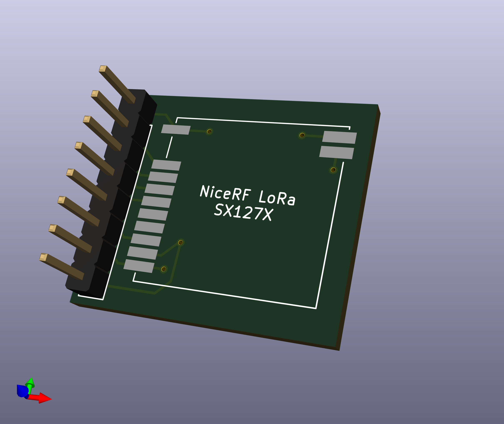
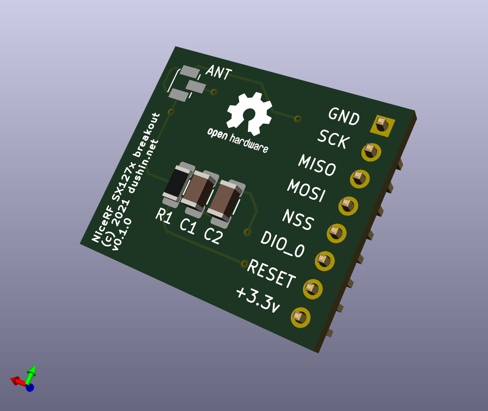

This repository contains [KiCad5](https://www.kicad.org) files for a small (less than 1" square) 2-sided PCB that can be used to integrate a [NiceRF SX127X](https://www.nicerf.com/products/detail/100mw-lora-wireless-transceiver-module-lora1276-915.html) (or equivalent) LoRa transceiver into your maker projects.

The [NiceRF SX127X](https://www.nicerf.com/products/detail/100mw-lora-wireless-transceiver-module-lora1276-915.html) LoRa transceiver has some desirable properties, such as its small form factor, ability to integrate flexibly with ESP32 projects (unlike some integrated development boards), and it is probably one of the more affordable SX127X boards out there.  In addition, the NiceRF team provides great support for their products.

This PCB adds support for:

* One [NiceRF SX127X](https://www.nicerf.com/products/detail/100mw-lora-wireless-transceiver-module-lora1276-915.html) module
* 2.54mm pins for GND, +3.3v, MOSI, MISO, SCLK, NSS, RESET (optional), and DPIO_0 pins on the NiceRF board, making the board slightly easier to use with standard dupont wires or breadboards;
* A set of pads for a standard IPEX antenna connector;
* A 1206 SMT 10k ohm resistor for the RESET circuit;
* Two 1206 SMT capacitors (optional).

Caveats:

* Currently no support for `DIO_1` and `DIO_2` pins (but could be added easily);
* Only tested on SX1276-915 modules;
* Has not been tested with SWT or VNA meter for antenna circuit leakage or reflection.

This work is licensed under the terms of the BSD License 2.0.  Enjoy!
